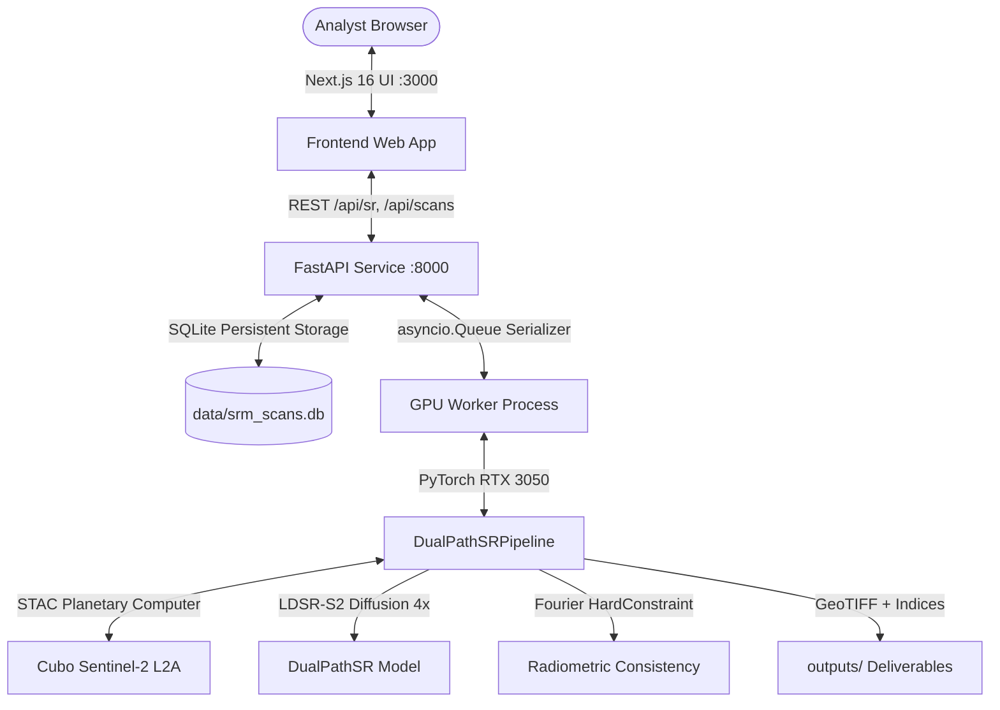

# Codebase Architecture & Dependency Graph (Graphify)

> **Repository:** Deep-Learning-Based-Super-Resolution-Mapping-SRM-from-Medium-Resolution-Satellite-Imageries  
> **Total Indexed Nodes:** 889  
> **Total Directed Edges:** 1583  
> **Interactive Graph:** [graph.html](file:///C:/DL SRM/graph.html)  
> **Raw Graph Dataset:** [graph.json](file:///C:/DL SRM/graph.json)

---

## 1. System Architecture Overview

---

## 2. Core Functional Subsystems

### A. Deep Learning Super-Resolution (`srm/`)
- **[srm/model.py](file:///C:/DL SRM/srm/model.py)**: Defines `DualPathSR` (SEN2SRLite SWIR + LDSR-S2 VNIR diffusion with Fourier HardConstraint).
- **[srm/pipeline.py](file:///C:/DL SRM/srm/pipeline.py)**: High-level inference coordinator `DualPathSRPipeline`.
- **[srm/flexible_input.py](file:///C:/DL SRM/srm/flexible_input.py)**: On-demand coordinates fetcher via planetary STAC, 10-band spectral preservation, uncertainty estimation, and CRS GeoTIFF writer.
- **[srm/uncertainty.py](file:///C:/DL SRM/srm/uncertainty.py)**: Monte Carlo epistemic uncertainty variance calculator across diffusion steps.
- **[srm/explainability.py](file:///C:/DL SRM/srm/explainability.py)**: Local Attribution Map (LAM) receptive field generator.

### B. REST API & Persistence (`srm_api/`)
- **[srm_api/main.py](file:///C:/DL SRM/srm_api/main.py)**: FastAPI router, GPU serialization worker, endpoints:
  - `POST /api/sr/submit` — Enqueue SR task
  - `GET /api/sr/status/:jobId` — Queue and execution status
  - `GET /api/sr/result/:jobId` — Full analysis payload
  - `GET /api/scans` — SQLite history query (filter, search)
  - `GET /api/scans/:jobId` — Single scan record
  - `GET /api/health` — Cluster health & queue depth
- **[srm_api/db.py](file:///C:/DL SRM/srm_api/db.py)**: SQLite interface managing `data/srm_scans.db`, automatic backfilling, and reverse geocoding to human-readable area names.
- **[srm_api/schemas.py](file:///C:/DL SRM/srm_api/schemas.py)**: Pydantic v2 data transfer models.

### C. Planetary Command Center Frontend (`frontend/`)
- **[frontend/src/app/page.tsx](file:///C:/DL SRM/frontend/src/app/page.tsx)**: Command Center cockpit with planetary map, floating 3D command deck, quality selector, and mission presets.
- **[frontend/src/components/MapPicker.tsx](file:///C:/DL SRM/frontend/src/components/MapPicker.tsx)**: Leaflet map with ESRI High-Resolution satellite imagery, boundaries/places reference layer, and targeting footprint.
- **[frontend/src/components/ScansArchiveDrawer.tsx](file:///C:/DL SRM/frontend/src/components/ScansArchiveDrawer.tsx)**: High-z-index slide-out drawer displaying past scans from SQLite with area names, thumbnails, and 1-click inspection.
- **[frontend/src/components/ResultsPanel.tsx](file:///C:/DL SRM/frontend/src/components/ResultsPanel.tsx)**: 3D Triad comparison (10m vs 2.5m vs Uncertainty), 10-band spectral preservation plot, indices viewer, and GeoTIFF downloads.
- **[frontend/src/components/CommandHeader.tsx](file:///C:/DL SRM/frontend/src/components/CommandHeader.tsx)**: Live UTC telemetry bar, search jump, and archive count badge.
- **[frontend/src/components/LiquidBackdrop.tsx](file:///C:/DL SRM/frontend/src/components/LiquidBackdrop.tsx)**: GPU-friendly ambient radial gradients.
- **[frontend/src/components/GlobalIcons.tsx](file:///C:/DL SRM/frontend/src/components/GlobalIcons.tsx)**: Hand-crafted SVG vector suite.

---

## 3. Key Symbols & Class Directory

| Category | Identifier | File | Purpose |
|---|---|---|---|
| **Class** | `CodebaseGraphifier` | [graphify.py](file:///C:/DL SRM/graphify.py) |  |
| **Class** | `AOIConfig` | [srm/config.py](file:///C:/DL SRM/srm/config.py) | Configuration for a specific Area of Interest (AOI). |
| **Class** | `ModelsConfig` | [srm/config.py](file:///C:/DL SRM/srm/config.py) | Model checkpoint and directory configuration. |
| **Class** | `BandsConfig` | [srm/config.py](file:///C:/DL SRM/srm/config.py) | Spectral band configuration and index mapping. |
| **Class** | `PreprocessingConfig` | [srm/config.py](file:///C:/DL SRM/srm/config.py) | Preprocessing normalization, masking, and padding settings. |
| **Class** | `HardConstraintConfig` | [srm/config.py](file:///C:/DL SRM/srm/config.py) | Fourier frequency constraint settings. |
| **Class** | `OutputConfig` | [srm/config.py](file:///C:/DL SRM/srm/config.py) | Output directory and export formatting configuration. |
| **Class** | `SRMConfig` | [srm/config.py](file:///C:/DL SRM/srm/config.py) | Root configuration object containing all subsystem settings. |
| **Class** | `FlexibleSRResult` | [srm/flexible_input.py](file:///C:/DL SRM/srm/flexible_input.py) |  |
| **Class** | `IngestionError` | [srm/ingestion.py](file:///C:/DL SRM/srm/ingestion.py) | Base exception for data ingestion failures. |
| **Class** | `NoScenesFoundError` | [srm/ingestion.py](file:///C:/DL SRM/srm/ingestion.py) | Raised when the STAC query returns zero scenes for the given AOI and window. |
| **Class** | `PaddingInfo` | [srm/preprocessing.py](file:///C:/DL SRM/srm/preprocessing.py) | Stores spatial padding margins applied to a tensor. |
| **Class** | `ModelLoadingError` | [srm/sr_pipeline.py](file:///C:/DL SRM/srm/sr_pipeline.py) | Raised when pretrained weights or model architecture fails to load. |
| **Class** | `InferenceError` | [srm/sr_pipeline.py](file:///C:/DL SRM/srm/sr_pipeline.py) | Raised when model inference fails or produces corrupt (NaN/Inf) values. |
| **Class** | `DualPathSRPipeline` | [srm/sr_pipeline.py](file:///C:/DL SRM/srm/sr_pipeline.py) | Manages dual-model execution, multimodal fusion, and frequency filtering. |
| **Component** | `RootLayout` | [frontend/src/app/layout.tsx](file:///C:/DL SRM/frontend/src/app/layout.tsx) | React UI Component |
| **Component** | `HomePage` | [frontend/src/app/page.tsx](file:///C:/DL SRM/frontend/src/app/page.tsx) | React UI Component |
| **Component** | `ResultsPage` | [frontend/src/app/results/[jobId]/page.tsx](file:///C:/DL SRM/frontend/src/app/results/[jobId]/page.tsx) | React UI Component |
| **Component** | `BeforeAfterSlider` | [frontend/src/components/BeforeAfterSlider.tsx](file:///C:/DL SRM/frontend/src/components/BeforeAfterSlider.tsx) | React UI Component |
| **Component** | `Card3D` | [frontend/src/components/Card3D.tsx](file:///C:/DL SRM/frontend/src/components/Card3D.tsx) | React UI Component |
| **Component** | `CommandHeader` | [frontend/src/components/CommandHeader.tsx](file:///C:/DL SRM/frontend/src/components/CommandHeader.tsx) | React UI Component |
| **Component** | `Satellite3DIcon` | [frontend/src/components/GlobalIcons.tsx](file:///C:/DL SRM/frontend/src/components/GlobalIcons.tsx) | React UI Component |
| **Component** | `SpectralPrismIcon` | [frontend/src/components/GlobalIcons.tsx](file:///C:/DL SRM/frontend/src/components/GlobalIcons.tsx) | React UI Component |
| **Component** | `RadarReticleIcon` | [frontend/src/components/GlobalIcons.tsx](file:///C:/DL SRM/frontend/src/components/GlobalIcons.tsx) | React UI Component |
| **Component** | `EarthGlobeIcon` | [frontend/src/components/GlobalIcons.tsx](file:///C:/DL SRM/frontend/src/components/GlobalIcons.tsx) | React UI Component |
| **Component** | `DatabaseArchiveIcon` | [frontend/src/components/GlobalIcons.tsx](file:///C:/DL SRM/frontend/src/components/GlobalIcons.tsx) | React UI Component |
| **Component** | `LiquidWaveIcon` | [frontend/src/components/GlobalIcons.tsx](file:///C:/DL SRM/frontend/src/components/GlobalIcons.tsx) | React UI Component |
| **Type** | `MaximizeImageData` | [frontend/src/components/ImageMaximizeModal.tsx](file:///C:/DL SRM/frontend/src/components/ImageMaximizeModal.tsx) | TypeScript Contract |
| **Type** | `QualityTierSteps` | [frontend/src/lib/constants.ts](file:///C:/DL SRM/frontend/src/lib/constants.ts) | TypeScript Contract |
| **Type** | `SubmitResponse` | [frontend/src/types/index.ts](file:///C:/DL SRM/frontend/src/types/index.ts) | TypeScript Contract |
| **Type** | `StatusResponse` | [frontend/src/types/index.ts](file:///C:/DL SRM/frontend/src/types/index.ts) | TypeScript Contract |
| **Type** | `BandMetrics` | [frontend/src/types/index.ts](file:///C:/DL SRM/frontend/src/types/index.ts) | TypeScript Contract |
| **Type** | `BandPreservationStat` | [frontend/src/types/index.ts](file:///C:/DL SRM/frontend/src/types/index.ts) | TypeScript Contract |
| **Type** | `SRResult` | [frontend/src/types/index.ts](file:///C:/DL SRM/frontend/src/types/index.ts) | TypeScript Contract |
| **Type** | `SubmitPayload` | [frontend/src/types/index.ts](file:///C:/DL SRM/frontend/src/types/index.ts) | TypeScript Contract |
| **Type** | `ScanRecord` | [frontend/src/types/index.ts](file:///C:/DL SRM/frontend/src/types/index.ts) | TypeScript Contract |
| **Type** | `ScansResponse` | [frontend/src/types/index.ts](file:///C:/DL SRM/frontend/src/types/index.ts) | TypeScript Contract |
| **Type** | `JobStatus` | [frontend/src/types/index.ts](file:///C:/DL SRM/frontend/src/types/index.ts) | TypeScript Contract |

---

## 4. Querying & Navigating with Graphify

In any upcoming query or modification:
1. **Targeting Modules**: Check dependencies in `graph.json` before refactoring.
2. **Contract Consistency**: Cross-verify Pydantic models in `srm_api/schemas.py` with TypeScript interfaces in `frontend/src/types/index.ts`.
3. **Pipeline Invariance**: Core inference logic in `srm/` communicates with `srm_api/` via `run_sr_from_latlon` returning `FlexResult`.
