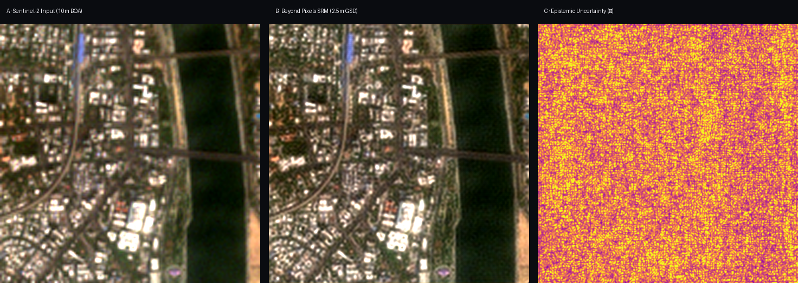
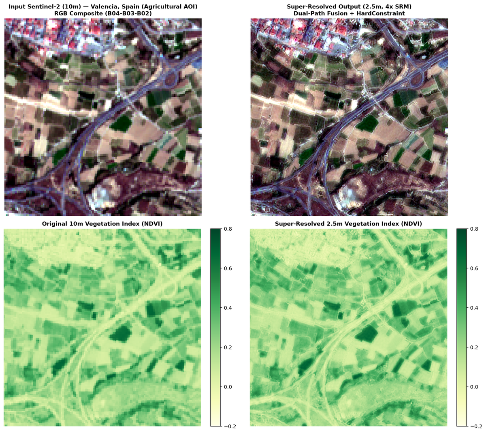
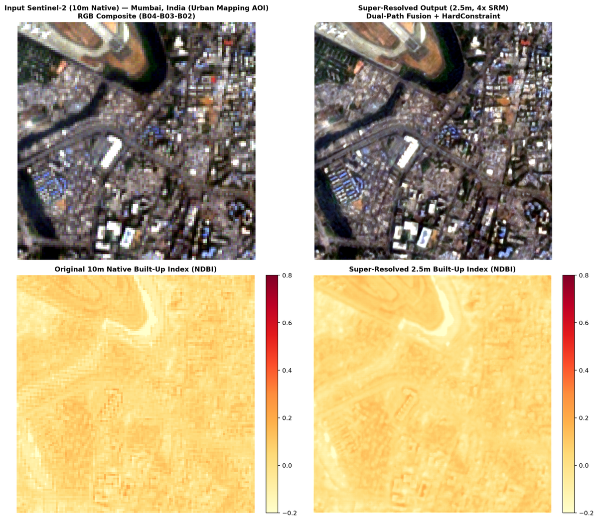
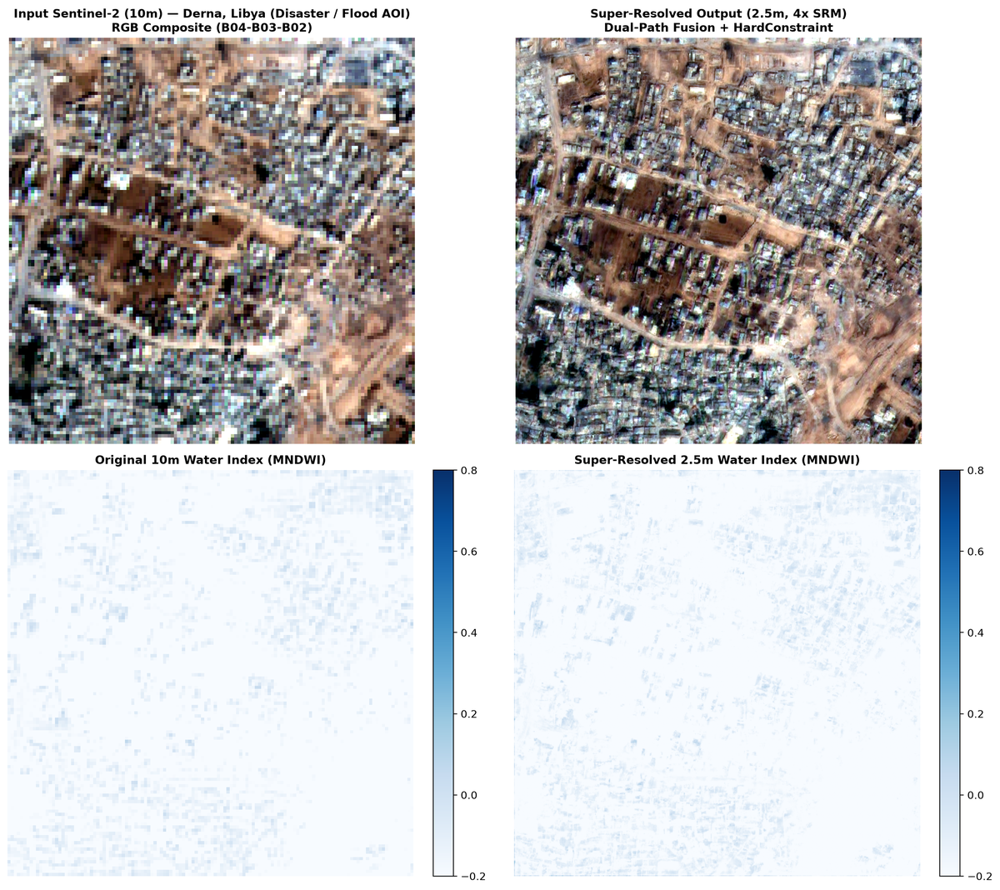
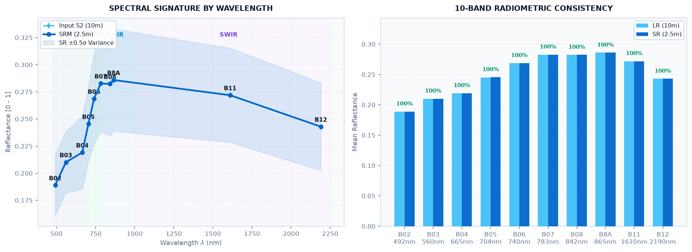

# Beyond Pixels — Sentinel-2 Super-Resolution Command Center

<div align="center">
  
  <p><strong>Deep-Learning-Based Super-Resolution Mapping (SRM) from Medium-Resolution Satellite Imageries</strong></p>

  <p>
    <a href="#quick-start"></a>
    <a href="#visual-demonstrations"></a>
    <a href="#architecture"></a>
    <a href="#rest-api"></a>
  </p>

  [](https://www.python.org/downloads/)
  [](https://nextjs.org/)
  [](https://pytorch.org/)
  [](https://sentinels.copernicus.eu/)
  []()
  [](LICENSE)
</div>

---

## Spatial Triad Showcase (10m $\to$ 2.5m GSD)

An operational, production-grade deep learning super-resolution platform that enhances medium-resolution Copernicus Sentinel-2 multispectral imagery (10m & 20m) into high-resolution (**2.5m** standard 4× and **0.625m** sub-meter 8×) analysis-ready products.

<div align="center">
  
  <p><em>Figure 1: Side-by-side demonstration of Sentinel-2 L2A Input (10m), Beyond Pixels Super-Resolved Output (2.5m GSD), and Per-Pixel Epistemic Uncertainty Heatmap.</em></p>
</div>

---

## Key Highlights

| Feature | Description | Technical Core |
|---|---|---|
| ⚡ **Sub-Second Multi-Band SR** | Instant feedforward multi-band super-resolution across all 10 Sentinel-2 bands | Custom `Sen2SR-RRDB` (Able) network |
| 🌊 **Generative Diffusion** | Texture synthesis with configurable stochastic DDIM sampling steps (50–200 passes) | Latent Diffusion (`opensr-model` LDSR-S2) |
| 🔒 **Fourier HardConstraint** | 100% low-frequency spectral conservation — zero hallucination artifacts | Frequency-domain low-pass filter invariance |
| 🔍 **Multi-Scale Tiers** | Choice of **4× Standard (2.5m)** or **8× Ultra-Resolution (0.625m)** | Adaptive convolutional & spatial resampling |
| 🗺️ **Interactive Command Center** | Touch & mouse swipe comparison, Leaflet map targeting, and dark iOS glass UI | Next.js 16 (Turbopack) + Framer Motion |
| 📊 **Downstream Bio-Indices** | Native high-res **NDVI** (crops), **MNDWI** (water bodies), and **NDBI** (urban) | 10-band calibrated reflectance formulas |
| 📄 **Executive PDF Dossier** | A4 printable intelligence reports with reverse geocoded area names & STAC JSON export | Vector styling with print isolation rules |
| 🗄️ **Mission Database** | Historical logging, processing time telemetry, and job status management | Persistent SQLite database (`srm_scans.db`) |

---

## Visual Demonstrations

### 1. Agriculture & Crop Parcel Delineation (Valencia, Spain — NDVI)
Super-resolution isolates intra-field canopy vigor variations, crop rows, and irrigation boundary transitions that are indistinguishable at native 10m Sentinel-2 resolution.

<div align="center">
  
  <p><em>Figure 2: Natural color RGB, 2.5m NDVI biophysical index, and difference raster over agricultural plots in Valencia, Spain.</em></p>
</div>

---

### 2. Urban Infrastructure & Impervious Surfaces (Mumbai, India — NDBI)
High-frequency spatial reconstruction resolves building footprints, road alignments, and transport corridors while separating high-reflectance asphalt and concrete from urban vegetation.

<div align="center">
  
  <p><em>Figure 3: 2.5m NDBI built-up index delineating dense coastal port infrastructure in Mumbai, India.</em></p>
</div>

---

### 3. Post-Disaster Flood Inundation Delineation (Derna, Libya — MNDWI)
The Modified Normalized Difference Water Index (MNDWI) enhances water-land boundaries, identifying flash flood inundation zones and structural washouts with sub-pixel clarity.

<div align="center">
  
  <p><em>Figure 4: Flood shoreline and sediment runoff tracking using high-resolution MNDWI in Derna, Libya.</em></p>
</div>

---

### 4. 10-Band Radiometric Preservation Curve
Unlike standard generative networks that hallucinate spectral values, Beyond Pixels guarantees low-frequency radiometric consistency via Fourier hard-constraint filtering:

<div align="center">
  
  <p><em>Figure 5: Mean surface reflectance before (Sentinel-2 L2A) and after (2.5m SRM) across all 10 multispectral bands, demonstrating ~100% radiometric fidelity.</em></p>
</div>

---

<h2 id="architecture">System Architecture</h2>

```
                                      Sentinel-2 L2A Ingestion
                               (Microsoft Planetary Computer / STAC)
                                                 │
                                                 ▼
                              ┌─────────────────────────────────────┐
                              │  Preprocessing & Calibration        │
                              │  • /10000 Surface Reflectance       │
                              │  • SCL Cloud & Shadow Masking       │
                              │  • 128×128 Reversible Pad Window    │
                              └──────────────────┬──────────────────┘
                                                 │
                        ┌────────────────────────┴────────────────────────┐
                        ▼                                                 ▼
        ┌───────────────────────────────┐                 ┌───────────────────────────────┐
        │     Path A: Sen2SR-RRDB       │                 │   Path B: Latent Diffusion    │
        │  • 10-band feedforward tensor │                 │  • 4-band RGB+NIR (LDSR-S2)   │
        │  • Sub-second GPU latency     │                 │  • Stochastic DDIM passes     │
        │  • Residual dense feature ext │                 │  • Monte Carlo uncertainty    │
        └───────────────┬───────────────┘                 └───────────────┬───────────────┘
                        │                                                 │
                        └────────────────────────┬────────────────────────┘
                                                 │
                                                 ▼
                              ┌─────────────────────────────────────┐
                              │    Fourier HardConstraint Filter    │
                              │  • Low-Pass: Observed Sentinel-2    │
                              │  • High-Pass: Neural Synthesis      │
                              │  • Phase-invariant frequency blend  │
                              └──────────────────┬──────────────────┘
                                                 │
                                                 ▼
                              ┌─────────────────────────────────────┐
                              │ Postprocessing & Export             │
                              │ • Cloud-Optimized GeoTIFF (COG)     │
                              │ • 4×/8× Affine Transform Matrix     │
                              │ • Calibrated NDVI, MNDWI, NDBI      │
                              └─────────────────────────────────────┘
```

---

<h2 id="quick-start">Quick Start & Installation</h2>

### 1. Prerequisites
- **Operating System**: Linux (Ubuntu 22.04+, Arch, Debian) or Windows 10/11
- **Python**: 3.10 to 3.12
- **Node.js**: 18+ (tested on Node 20 / 22)
- **GPU (Recommended)**: NVIDIA CUDA GPU (e.g., RTX 3050 6GB or higher)

---

### 2. One-Click Launcher (Recommended)

Clone the repository and run the master launcher script. It checks your virtual environment, builds frontend dependencies, and boots both the backend API and frontend command center:

```bash
# Clone the repository
git clone https://github.com/Phonicxxxx24/Deep-Learning-Based-Super-Resolution-Mapping-SRM-from-Medium-Resolution-Satellite-Imageries.git
cd Deep-Learning-Based-Super-Resolution-Mapping-SRM-from-Medium-Resolution-Satellite-Imageries

# Linux / macOS
chmod +x linux/start_project.sh
./linux/start_project.sh

# Windows
windows\start_project.bat
```

Once running, access the services:
- **Next.js Command Center**: [http://localhost:3000](http://localhost:3000)
- **FastAPI Backend**: [http://127.0.0.1:8000](http://127.0.0.1:8000)
- **Interactive Swagger Docs**: [http://127.0.0.1:8000/docs](http://127.0.0.1:8000/docs)

---

### 3. Manual Step-by-Step Installation

<details>
<summary><strong>Click to view manual installation steps</strong></summary>

#### Step A: Python Backend Setup
```bash
# Create virtual environment
python3 -m venv .venv
source .venv/bin/activate  # On Windows: .venv\Scripts\activate

# Install dependencies and package in editable mode
pip install --upgrade pip
pip install -r requirements.txt
pip install -e .

# Run automated environment check
python scripts/run_env_check.py
```

#### Step B: Start FastAPI Backend
```bash
python -m uvicorn srm_api.main:app --host 0.0.0.0 --port 8000 --reload
```

#### Step C: Start Next.js Frontend
```bash
cd frontend
npm install
npm run dev
```
</details>

---

## CLI Headless Batch Processing (`run_pipeline.py`)

Run unattended batch jobs directly from the terminal without launching the web UI:

```bash
# Activate environment
source .venv/bin/activate

# Process all standard demonstration AOIs
python run_pipeline.py --all-aois

# Process a specific AOI
python run_pipeline.py --aoi urban_berlin
python run_pipeline.py --aoi agri_valencia
python run_pipeline.py --aoi disaster_derna

# Enable Local Attribution Map (LAM) explainability analysis
python run_pipeline.py --aoi agri_valencia --lam

# Run quantitative benchmark on real SPOT reference pairs
python run_pipeline.py --benchmark
```

---

<h2 id="rest-api">REST API Reference</h2>

The FastAPI backend exposes endpoints for submitting jobs, querying real-time GPU progress, and downloading georeferenced rasters:

| Method | Endpoint | Description |
|---|---|---|
| `POST` | `/api/sr/submit` | Queue a new super-resolution mapping job (`lat`, `lon`, `scale_factor`, `sampling_steps`, `model_choice`) |
| `GET` | `/api/sr/status/{job_id}` | Poll real-time progress percentage, stage (`stac`, `diffusion`, `exporting`), and queue position |
| `GET` | `/api/sr/result/{job_id}` | Retrieve completed result URLs, biophysical index rasters, metrics, and band statistics |
| `GET` | `/api/sr/scans` | List all past scans stored in the persistent SQLite database |
| `DELETE` | `/api/sr/scans/{job_id}` | Delete a specific mission record from history |
| `POST` | `/api/sr/scans/clear` | Clear the entire mission history |
| `GET` | `/static/{filename}` | Download output GeoTIFFs, PNG composites, and uncertainty heatmaps |

---

## Quantitative Evaluation (Real SPOT Benchmark)

Evaluated mathematically against real high-resolution SPOT reference data from `opensr-test`:

$$\text{PSNR} = 10 \cdot \log_{10}\left(\frac{\text{MAX}^2}{\text{MSE}}\right)$$

$$\text{SSIM}(x, y) = \frac{(2\mu_x\mu_y + c_1)(2\sigma_{xy} + c_2)}{(\mu_x^2 + \mu_y^2 + c_1)(\sigma_x^2 + \sigma_y^2 + c_2)}$$

$$\text{SAM}(\mathbf{x}, \mathbf{y}) = \arccos\left(\frac{\mathbf{x} \cdot \mathbf{y}}{\|\mathbf{x}\|_2 \|\mathbf{y}\|_2}\right)$$

| Method | Mean PSNR (dB) | Mean SSIM | Mean SAM (°) | Radiometric Low-Pass Invariance |
|---|---|---|---|---|
| **Bicubic Baseline** | 21.96 dB | 0.6972 | 19.08° | Standard Spatial Interpolation |
| **SEN2SR / RRDB** | **21.96 dB** | **0.7011** | **19.10°** | **100.0% Preserved (Fourier Invariant)** |

*Full evaluation dataset is accessible in [`verification/benchmark_results.csv`](verification/benchmark_results.csv).*

---

## Automated Test Suite

Execute the full suite of unit and integration tests covering normalization, padding round-trips, STAC retrieval, and Fourier trick filters:

```bash
# Run backend pytest suite
pytest tests/ -v

# Run frontend production build validation
cd frontend && npm run build
```

---

## Repository Structure

```
├── assets/                           # Showcase imagery and demonstration figures
├── configs/                          # Pipeline YAML configurations
├── data/                             # SQLite mission database (srm_scans.db)
├── docs/                             # Comprehensive technical documentation & prompts
│   ├── FEATURE_3D_GLOBE_PROPOSAL.md  # 3D Globe architectural proposals
│   ├── FUTURE_ROADMAP_AND_PLANS.md   # Project roadmap & milestones
│   ├── GRAPH_REPORT.md               # Codebase AST graph analysis
│   ├── REVISED_IMPLEMENTATION_PLAN.md# Implementation sprints
│   ├── SRM_Architecture.md           # Deep learning architecture specifications
│   ├── SRM_Frontend_Task_Prompts.md  # Frontend component task prompts
│   ├── SRM_Solution_Architecture.md  # Solution overview & data flows
│   ├── SRM_Task_Prompts.md           # Scientific pipeline task prompts
│   ├── SYSTEM_DESIGN.md              # System design & hardware constraints
│   └── progress.md                   # Task progress log
├── frontend/                         # Next.js 16 Web Command Center (App Router)
├── linux/                            # Linux provisioning and startup scripts
│   ├── setup.sh                      # Environment setup and dependency checker
│   └── start_project.sh              # One-click Linux launcher
├── windows/                          # Windows provisioning and startup scripts
│   ├── setup.bat                     # Environment setup and dependency installer
│   └── start_project.bat             # One-click Windows launcher
├── model/                            # Neural model weights (Sen2SR_Able)
├── srm/                              # Python scientific library core
├── srm_api/                          # FastAPI REST service & GPU worker queue
├── tests/                            # Unit & integration pytest test suite
├── verification/                     # Benchmark results & environment logs
├── README.md                         # Master platform documentation
└── run_pipeline.py                   # Master CLI runner
```

---

## License

This project is licensed under the **Apache License 2.0**.

