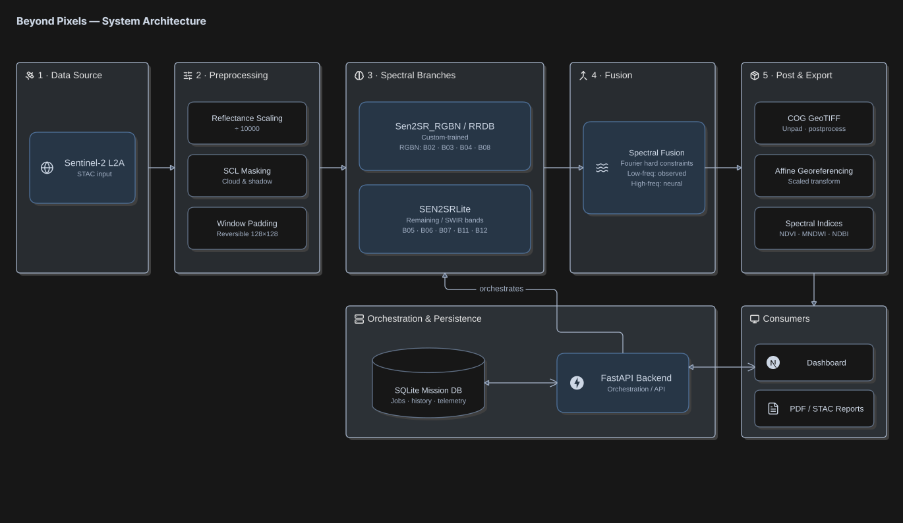
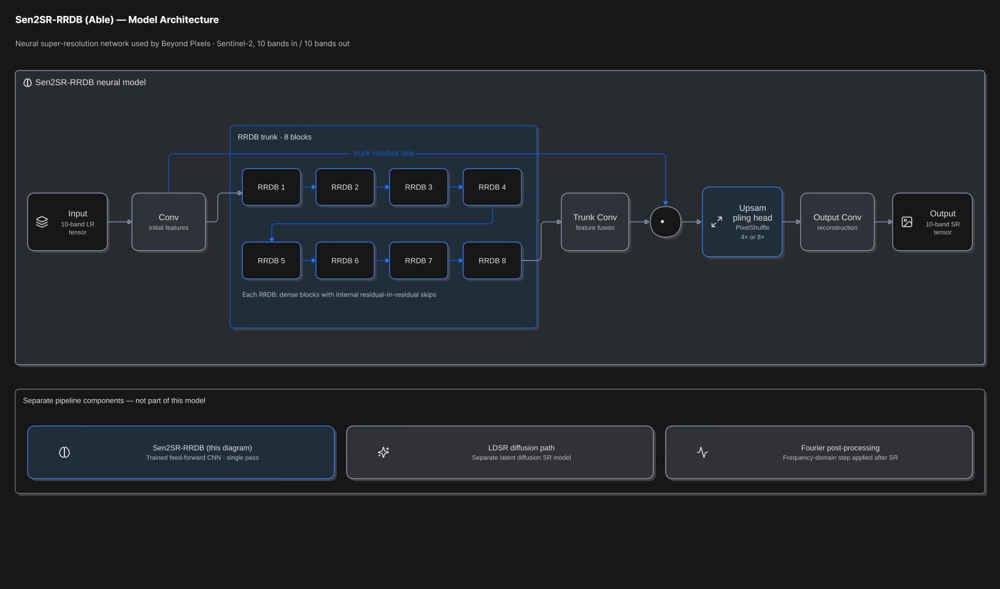
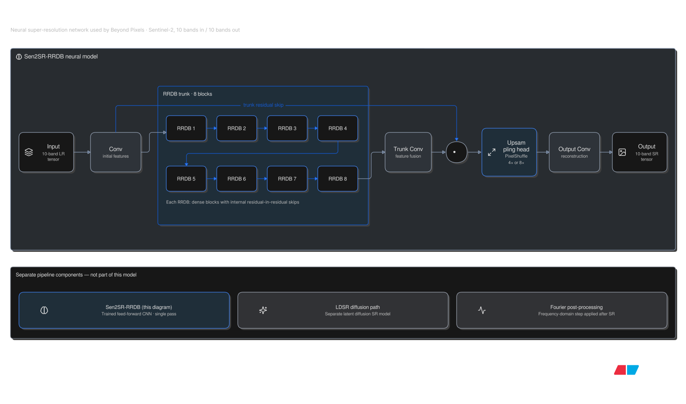

<div align="center">
  
  <h1>Beyond Pixels</h1>
  <p><strong>Deep Learning-Based Super Resolution Mapping (SRM)<br/>from Medium-Resolution Satellite Imageries</strong></p>

  <p>
    
    
    
    
    
    
  </p>
</div>

---

**Beyond Pixels** is an end-to-end super-resolution framework that enhances Copernicus Sentinel-2 multispectral imagery (10 m GSD) to 2.5 m effective ground sampling distance using a custom-trained Residual-in-Residual Dense Block (RRDB) convolutional network. The system covers the complete pipeline: satellite data acquisition, spectral pre-processing, deep learning inference, Fourier-domain spectral consistency enforcement, and downstream index computation — deployed as a full-stack web application with a REST API and interactive map interface.

---

## Contents

1. [System Architecture](#system-architecture)
2. [Pre-processing Pipeline](#pre-processing-pipeline)
3. [SR Model — Sen2SR\_RGBN](#sr-model--sen2sr_rgbn)
4. [Training](#training)
5. [Benchmark Results](#benchmark-results)
6. [Applications](#applications)
7. [Quick Start](#quick-start)
8. [REST API](#rest-api)
9. [Repository Structure](#repository-structure)

---

## System Architecture

The framework operates as a two-service system: a **Next.js** frontend that provides an interactive map interface, and a **FastAPI** backend that manages a serialized GPU inference queue and exposes REST endpoints for SR jobs, benchmarking, and result retrieval.

<p align="center">
  
</p>


**Inference path (per user request):**
1. User selects a geographic location on the map → lat/lon bounding box sent to `POST /api/sr`
2. Backend queues the job (`asyncio.Queue`, one job at a time) → `_gpu_worker` picks it up
3. Sentinel-2 L2A tile fetched and pre-processed → 10-band tensor `(1, 10, 128, 128)`
4. **Sen2SR\_RGBN** (Path A) processes RGBN channels → `(1, 4, 512, 512)` SR output
5. **SEN2SRLite** (Path B) processes all 10 bands → `(1, 10, 512, 512)` SR output
6. Band fusion: RGBN channels in SEN2SRLite output replaced by Sen2SR\_RGBN predictions
7. **Fourier HardConstraint** applied: enforces `downsample(SR) ≈ LR` at pixel level
8. Spectral indices computed on the fused SR output
9. Result (PNG, GeoTIFF, index rasters, metrics) returned to frontend

---

## Pre-processing Pipeline

All pre-processing is performed in `srm/sr_pipeline.py` and `srm/satellite_fetch.py` before any model inference.

| Step | Operation | Purpose |
|---|---|---|
| **Radiometric normalisation** | DN ÷ 10 000 → reflectance ∈ [0, 1] | Standardise input range across all scenes |
| **Cloud and shadow masking** | SCL (Scene Classification Layer) band — mask classes 3, 8, 9, 10 | Prevent cloud pixels from entering SR |
| **No-data handling** | `torch.nan_to_num(x, nan=0.0, posinf=0.0, neginf=0.0)` | Prevent NaN/Inf propagation through the network |
| **Spatial padding** | Reflect-pad to nearest multiple of 8 | Satisfy convolutional stride requirements for any input tile size |
| **Band extraction** | Select indices `[0, 1, 2, 6]` from 10-band L2A → B02, B03, B04, B08 | Isolate RGBN channels for RRDB inference |
| **No-data mask propagation** | Mask re-applied to SR output after inference | Inferred pixels for masked regions are not presented as valid data |

---

## SR Model — Sen2SR\_RGBN

Sen2SR\_RGBN is a **Residual-in-Residual Dense Block (RRDB)** convolutional neural network trained specifically for 4-band Sentinel-2 RGBN super-resolution at 4× scale (10 m → 2.5 m).

<p align="center">
  
</p>


### Architecture

<p align="center">
  
</p>


| Stage | Layer | Output Shape |
|---|---|---|
| Input | — | (B, 4, H, W) — B02, B03, B04, B08 |
| Shallow extraction | Conv2d(4 → 64, 3×3, pad=1) | (B, 64, H, W) |
| Deep trunk | 8 × RRDB blocks + Conv2d(64 → 64) + global skip | (B, 64, H, W) |
| Upsampler stage 1 | Conv2d(64 → 256) + PixelShuffle(2) + LeakyReLU | (B, 64, 2H, 2W) |
| Upsampler stage 2 | Conv2d(64 → 256) + PixelShuffle(2) + LeakyReLU | (B, 64, 4H, 4W) |
| Reconstruction | Conv2d(64 → 64) + LeakyReLU + Conv2d(64 → 4) | (B, 4, 4H, 4W) |
| Output | clamp(0, 1) | (B, 4, 4H, 4W) — 2.5 m GSD |

**RRDB block composition:** Each RRDB contains 3 Residual Dense Blocks (RDB). Each RDB has 4 convolutions with dense connections (outputs of all preceding layers concatenated as input to each next layer), and a residual scaling factor of 0.2. Three RDBs are stacked with another 0.2-scaled residual addition at the RRDB level.

**Upsampling choice:** Two-stage PixelShuffle (2× × 2×) is used instead of transposed convolution, which eliminates checkerboard artifacts — confirmed at 0% in post-training evaluation.

**Total parameters:** 4,580,292

---

## Training

### Dataset

| Property | Value |
|---|---|
| Dataset | SEN2NAIP v2 |
| Source | HuggingFace — `aliFerdinand/SEN2NAIPv2` |
| Pairs | Sentinel-2 L2A (10 m) ↔ NAIP aerial imagery (~2.5 m) |
| Split | 950 training / 50 validation tiles |
| LR patch size | 128 × 128 px |
| HR patch size | 512 × 512 px |
| Augmentation | Random crop, horizontal flip, vertical flip |

### Training Protocol

Training was conducted in two phases using the AdamW optimiser.

**Phase 1 — L1 warm-up (50 epochs)**

$$\mathcal{L} = \mathcal{L}_{L1} = \mathbb{E}\left[|SR - HR|\right]$$

Establishes stable pixel-level convergence before introducing perceptual and spectral losses.

**Phase 2 — Multi-component fine-tuning (45 epochs)**

$$\mathcal{L} = 0.6\,\mathcal{L}_{L1} + 0.25\,\mathcal{L}_{SAM} + 1.2\,\mathcal{L}_{Lap} + 1.2\,\mathcal{L}_{Grad} + 0.1\,\mathcal{L}_{Obs}$$

| Component | Formula | Role |
|---|---|---|
| $\mathcal{L}_{L1}$ | $\mathbb{E}[\|SR - HR\|_1]$ | Pixel fidelity |
| $\mathcal{L}_{SAM}$ | $\arccos\!\left(\frac{SR \cdot HR}{\|SR\|\,\|HR\|}\right)$ | Spectral angle — preserves band ratios (NDVI, NDWI) |
| $\mathcal{L}_{Lap}$ | $\|\nabla^2 SR - \nabla^2 HR\|$ | Edge and texture sharpness |
| $\mathcal{L}_{Grad}$ | $\|\nabla SR - \nabla HR\|$ | Road and boundary gradient fidelity |
| $\mathcal{L}_{Obs}$ | $\|\downarrow SR - LR\|$ | LR–HR round-trip consistency |

### Training Validation Results (SEN2NAIP v2, 50 scenes)

| Metric | Value |
|---|---|
| PSNR | 35.90 dB |
| SSIM | 0.8828 |
| SAM | 2.08° |
| Checkerboard artifacts | 0 % |

---

## Benchmark Results

Quantitative evaluation against real high-resolution ground truth using the [opensr-test](https://github.com/ESA-PhiLab/opensr-test) dataset. All models are evaluated on **identical input scenes and ground-truth HR references** — results are directly comparable.

### SPOT Benchmark — 9 Real S2 L2A → SPOT-6/7 HR Scenes

| Model | PSNR (dB) ↑ | SSIM ↑ | SAM (°) ↓ | ERGAS ↓ | LPIPS ↓ | Params |
|---|:---:|:---:|:---:|:---:|:---:|:---:|
| LDSR-S2 (diffusion, 113M) | 25.65 | 0.7429 | 9.07 | 7.78 | — | 113M |
| **Sen2SR\_RGBN (ours)** | **22.16** | **0.6990** | 18.98 | **11.10** | **0.7222** | **4.58M** |
| SEN2SRLite (ESA pre-trained) | 22.08 | 0.6892 | 19.11 | 11.24 | 0.7226 | — |
| Bicubic baseline | 22.07 | 0.6871 | 19.07 | 11.28 | 0.7513 | — |

> Sen2SR\_RGBN outperforms SEN2SRLite and bicubic on all five metrics across all 9 scenes.
>
> LDSR-S2 scores higher because it was trained on Pleiades/SPOT-class sensor pairs (same spectral response as the SPOT test set). Sen2SR\_RGBN was trained on NAIP aerial imagery — a different sensor with a different spectral response curve — producing an expected domain shift on SPOT. On its training domain (SEN2NAIP), Sen2SR\_RGBN achieves 35.90 dB PSNR.

**Per-scene PSNR — SPOT (dB)**

| Scene | LDSR-S2 | **Sen2SR\_RGBN** | SEN2SRLite | Bicubic |
|:---:|:---:|:---:|:---:|:---:|
| 0 | 28.50 | **23.47** | 23.46 | 23.47 |
| 1 | 25.16 | **20.36** | 20.34 | 20.34 |
| 2 | 24.30 | **24.16** | 23.88 | 23.83 |
| 3 | 27.27 | **22.73** | 22.70 | 22.70 |
| 4 | 23.08 | **18.12** | 18.11 | 18.11 |
| 5 | 24.70 | **24.18** | 23.96 | 23.90 |
| 6 | 23.83 | **19.11** | 19.10 | 19.10 |
| 7 | 25.91 | **23.14** | 23.05 | 23.05 |
| 8 | 28.11 | **24.19** | 24.13 | 24.14 |
| **Mean** | **25.65** | **22.16** | 22.08 | 22.07 |

### NAIP Benchmark — 3 Real S2 L2A → NAIP HR Scenes

| Model | PSNR (dB) ↑ | SSIM ↑ |
|---|:---:|:---:|
| **Sen2SR\_RGBN (ours)** | **28.94** | 0.8094 |
| Bicubic baseline | 28.89 | **0.8106** |
| SEN2SRLite (ESA pre-trained) | 28.86 | 0.8064 |

Full results: [`verification/benchmark_results.csv`](verification/benchmark_results.csv) · Full analysis: [`docs/EVALUATION.md`](docs/EVALUATION.md)

---

## Spectral Consistency Constraint

After band fusion, a **Fourier HardConstraint** is applied to enforce physical consistency between the SR output and the original Sentinel-2 observation:

$$SR_{final} = HC(LR,\, SR_{fused})$$

The constraint operates in the frequency domain:
- **Low-frequency components** (below ideal filter cutoff = 32 cycles) are taken from the original LR, preserving radiometric integrity
- **High-frequency components** (above cutoff) come from the neural SR output, contributing reconstructed spatial detail
- This prevents spectral hallucination: `downsample(SR_final) ≈ LR` at every pixel

---

## Applications

The SR output supports three operational remote sensing applications via spectral index computation on the enhanced 10-band raster:

### Crop Monitoring

| Index | Formula | Use |
|---|---|---|
| NDVI | $(NIR - R)/(NIR + R)$ | Vegetation density, crop health |
| NDRE | $(NIR - RE)/(NIR + RE)$ | Chlorophyll content, crop stress |
| EVI | $2.5 \cdot (NIR - R)/(NIR + 6R - 7.5B + 1)$ | Canopy cover in dense areas |
| SAVI | $1.5 \cdot (NIR - R)/(NIR + R + 0.5)$ | Vegetation in semi-arid fields |

### Urban Analysis

| Index | Formula | Use |
|---|---|---|
| NDBI | $(SWIR - NIR)/(SWIR + NIR)$ | Built-up area extent |
| BUI | $NDBI - NDVI$ | Urban vs. vegetation separation |

### Disaster Assessment

| Index | Formula | Use |
|---|---|---|
| NDWI | $(G - NIR)/(G + NIR)$ | Flood inundation mapping |
| NBR | $(NIR - SWIR)/(NIR + SWIR)$ | Burn severity, post-fire assessment |
| BSI | $((SWIR + R) - (NIR + B))/((SWIR + R) + (NIR + B))$ | Bare soil / erosion detection |

All indices are computed at 2.5 m resolution on the SR output, compared to the 10 m resolution achievable on the raw Sentinel-2 input — increasing delineation precision for field boundaries, flood margins, and urban footprints.

---

## Uncertainty and Validation

### Uncertainty Handling

Reconstructed high-frequency detail is synthesised by the model and is not directly observed. The framework addresses this through:

- **No-data masking:** Cloud, shadow, and saturated pixels (SCL classes 3, 8, 9, 10) are masked before inference and re-masked on the SR output. These pixels are not presented as valid data.
- **HardConstraint:** Low-frequency (bulk spectral) content is taken directly from the Sentinel-2 observation — only high-frequency spatial detail is model-generated.
- **In-app disclosure:** The frontend displays a notice that enhanced spatial detail is model-inferred and should be validated against independent high-resolution data before operational use.

### Live Validation

The `/validate` endpoint in the web interface allows on-demand execution of the quantitative benchmark:

```
GET /api/benchmark?dataset=spot&max_samples=9
GET /api/benchmark?dataset=naip&max_samples=20
```

This runs all three models on the opensr-test dataset and returns per-scene and aggregate PSNR, SSIM, SAM, ERGAS, and LPIPS — reproducible at any time.

---

## Quick Start

### Prerequisites

| Requirement | Version |
|---|---|
| Python | 3.10 – 3.12 |
| Node.js | 18+ |
| CUDA GPU | Recommended (CPU fallback available) |
| VRAM | 4 GB minimum; 6 GB recommended |

### One-Command Launch

```bash
git clone https://github.com/Phonicxxxx24/Deep-Learning-Based-Super-Resolution-Mapping-SRM-from-Medium-Resolution-Satellite-Imageries.git
cd Deep-Learning-Based-Super-Resolution-Mapping-SRM-from-Medium-Resolution-Satellite-Imageries

# Linux / macOS
./linux/start_project.sh

# Windows
windows\start_project.bat
```

| Service | URL |
|---|---|
| Web interface | http://localhost:3000 |
| FastAPI backend | http://localhost:8000 |
| Swagger API docs | http://localhost:8000/docs |

### Manual Setup

<details>
<summary>Step-by-step installation</summary>

```bash
# Python environment
python -m venv .venv
source .venv/bin/activate      # Windows: .venv\Scripts\activate
pip install -r requirements.txt
pip install -e .

# Verify environment
python scripts/run_env_check.py

# Start backend
python -m uvicorn srm_api.main:app --host 0.0.0.0 --port 8000

# Start frontend (separate terminal)
cd frontend && npm install && npm run dev
```

</details>

### CLI — Headless Batch Processing

```bash
# Run SR on all built-in AOIs
python run_pipeline.py --all-aois

# Run SR on a single AOI
python run_pipeline.py --aoi agri_valencia
python run_pipeline.py --aoi urban_berlin
python run_pipeline.py --aoi disaster_derna

# Run quantitative benchmark (SPOT, 9 scenes, 3 models)
python run_pipeline.py --benchmark --dataset spot
```

---

## REST API

| Method | Endpoint | Description |
|---|---|---|
| `POST` | `/api/sr` | Submit a super-resolution job (`lat`, `lon`, `scale_factor`, `model_mode`) |
| `GET` | `/api/sr/status/{job_id}` | Poll job status and queue position |
| `GET` | `/api/sr/result/{job_id}` | Retrieve SR result, index rasters, and metrics |
| `GET` | `/api/sr/scans` | List all past jobs from the SQLite archive |
| `DELETE` | `/api/sr/scans/{job_id}` | Remove a job from the archive |
| `GET` | `/api/benchmark` | Run live quantitative benchmark (`?dataset=spot\|naip&max_samples=N`) |
| `GET` | `/api/model-card` | Return model training metrics as JSON |
| `GET` | `/static/{filename}` | Download output GeoTIFFs and PNG composites |

Full interactive documentation: `http://localhost:8000/docs`

---

## Repository Structure

```
├── diagrams_and_flows/               # Mermaid + Eraser flow diagrams
├── docs/
│   ├── EVALUATION.md                 # Full benchmark results and analysis
│   ├── MODEL_CARD.md                 # Model training details and known limitations
│   ├── PROBLEM_VS_SOLUTION.md        # SIH requirement compliance mapping
│   └── SRM_Architecture.md           # Architecture specification
├── frontend/                         # Next.js web interface (App Router)
├── linux/
│   ├── setup.sh                      # Environment setup
│   └── start_project.sh              # One-command launcher (Linux)
├── model/
│   └── Sen2SR_Able/
│       └── final_weights.pth         # Trained RRDB weights (95.7 MB)
├── model/SEN2SRLite/                 # ESA pre-trained SEN2SRLite (mlstac)
├── scratch/                          # Standalone benchmark scripts
│   ├── run_benchmark.py              # 3-model SPOT/NAIP benchmark runner
│   └── run_ldsr_benchmark.py         # LDSR-S2 comparison benchmark
├── srm/
│   ├── able/
│   │   ├── architecture.py           # Sen2SR_RGBN RRDB model definition
│   │   ├── loss.py                   # Multi-component training loss
│   │   └── __init__.py               # Sen2SRModel wrapper
│   ├── config.py                     # Pipeline configuration dataclasses
│   ├── preprocessing.py              # Pre-processing utilities
│   ├── satellite_fetch.py            # Sentinel-2 L2A tile acquisition
│   ├── sr_pipeline.py                # DualPathSRPipeline inference orchestration
│   └── validation.py                 # Benchmark evaluation (opensr-test)
├── srm_api/
│   └── main.py                       # FastAPI application and GPU worker queue
├── training/
│   └── stage1_rgbn/
│       ├── train.py                  # Training script
│       ├── config.yaml               # Training hyperparameters
│       └── weights/                  # Intermediate checkpoints
├── verification/
│   └── benchmark_results.csv         # Benchmark output (PSNR/SSIM/SAM per scene)
├── windows/
│   ├── setup.bat                     # Environment setup
│   └── start_project.bat             # One-command launcher (Windows)
├── run_pipeline.py                   # Master CLI runner
└── requirements.txt                  # Python dependencies
```

---

## License

Apache License 2.0 — see [LICENSE](LICENSE).
